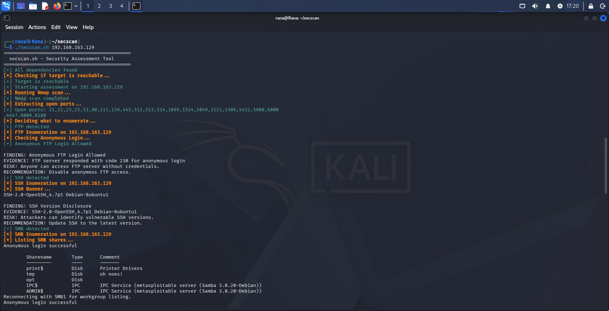
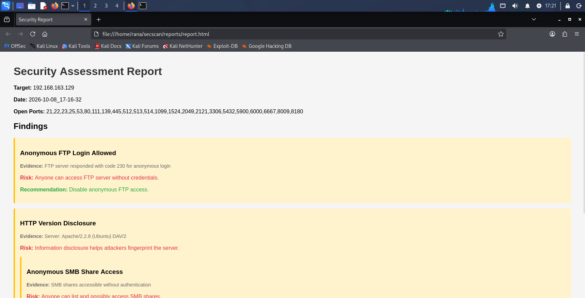

# 🛰️ secscan.sh - Bash Security Assessment Tool

A modular, automated security assessment framework built entirely in **Bash**.

Performs reconnaissance, port scanning, service enumeration, and generates structured, evidence-based reports — with a decision-making engine that adapts to the target's open services.

---

## 📖 Overview

secscan.sh is not just a wrapper around Nmap. It follows a real security assessment workflow:

**Reconnaissance → Port Scanning → Service Enumeration → Findings → Reports**

After scanning, it analyzes the results, detects which services are running, and automatically decides which enumeration modules to execute — no manual intervention required.

---

## ✨ Features

- 🔍 **Reconnaissance** — Ping check before scanning
- 🛰️ **Port Scanning** — Nmap-based service/version detection
- 🧠 **Decision-Making Logic** — Automatically selects which modules to run based on discovered services
- 🛠️ **Modular Architecture** — One module per service (FTP, SSH, SMB, SMTP, DNS, HTTP)
- 📋 **Evidence-Based Findings** — Each finding includes Evidence, Risk, and Recommendation
- 📄 **Structured Reports** — Text + HTML output
- 🎯 **Multiple Targets** — Scan multiple hosts from a file
- ⚙️ **CLI Flags** — --help / --version
- 🧹 **Auto-Cleanup** — Old reports are removed on each run

---

## 🛠️ Modules

| Module | Service | Check Performed |
|--------|---------|-----------------|
| modules/ftp.sh | FTP | Anonymous login |
| modules/ssh.sh | SSH | Banner & version disclosure |
| modules/smb.sh | SMB | Share enumeration (anonymous access) |
| modules/smtp.sh | SMTP | Open relay + user enumeration |
| modules/dns.sh | DNS | Zone transfer |
| modules/http.sh | HTTP | Headers, robots.txt, Gobuster, Nikto, HTTP methods |

---

## 📁 Project Structure

    secscan/
    ├── secscan.sh
    ├── modules/
    │   ├── ftp.sh
    │   ├── ssh.sh
    │   ├── smb.sh
    │   ├── smtp.sh
    │   ├── dns.sh
    │   └── http.sh
    ├── reports/
    │   ├── scan.txt
    │   ├── findings.txt
    │   ├── summary.txt
    │   ├── report.html
    │   └── modules/
    ├── .gitignore
    └── README.md

---

## 🚀 Usage

### Make executable

    chmod +x secscan.sh
    chmod +x modules/*.sh

### Run

    ./secscan.sh <TARGET>

### Examples

    ./secscan.sh 192.168.1.100
    ./secscan.sh scanme.nmap.org

### Multiple targets

Create a file with one target per line, then run:

    ./secscan.sh targets.txt

### Help & Version

    ./secscan.sh --help
    ./secscan.sh --version

---

## 📋 Requirements

**Required:**

- nmap
- ping
- curl
- nc (netcat)
- smbclient
- host (dnsutils)

**Optional:**

- smtp-user-enum
- gobuster
- nikto

**Install on Kali:**

    sudo apt update
    sudo apt install -y nmap curl netcat-openbsd smbclient dnsutils smtp-user-enum gobuster nikto

---

## 📊 Sample Output

    =============================================
      secscan.sh - Security Assessment Tool
    =============================================
    [+] All dependencies found
    [*] Checking if target is reachable...
    [+] Target is reachable
    [*] Running Nmap scan...
    [+] Nmap scan completed
    [*] Extracting open ports...
    [+] Open ports: 21,22,23,25,53,80,139,445,...
    [*] Deciding what to enumerate...
    [+] FTP detected
    [*] FTP Enumeration on 192.168.1.100
    [+] Anonymous FTP Login Allowed

    FINDING: Anonymous FTP Login Allowed
    EVIDENCE: FTP server responded with code 230 for anonymous login
    RISK: Anyone can access FTP server without credentials.
    RECOMMENDATION: Disable anonymous FTP access.

---

## 📄 Report Format

Each finding is structured as:

    FINDING: <name>
    EVIDENCE: <proof from the target>
    RISK: <why it matters>
    RECOMMENDATION: <how to fix it>

Reports are saved to reports/:

- scan.txt — Full Nmap output
- findings.txt — All findings from modules
- summary.txt — Quick summary
- report.html — Visual HTML report
- modules/*.txt — Per-service raw output

---

## ⚠️ Disclaimer

This tool is for **educational purposes only**.

Only scan systems you own or have explicit permission to test.

Unauthorized scanning is illegal.

---

### Execution

### HTML Report

---

## 👩‍💻 Author

**Rana Elgeddawy**

- GitHub: @ranaelgeddawy
